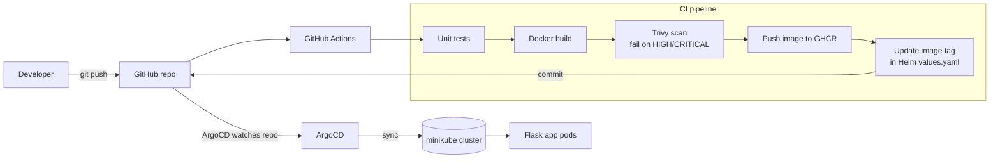

# devsecops-gitops-lab

A hands-on lab showing a complete **DevSecOps + GitOps** flow on a local Kubernetes cluster:
a small Flask app is tested, built, **scanned for vulnerabilities (Trivy)**, pushed to a
container registry, and deployed automatically by **ArgoCD** from a **Helm** chart.

**Stack:** Python (Flask) · Docker · GitHub Actions · Trivy · GHCR · Helm · ArgoCD · minikube

## Architecture



## How it works

1. A push to `main` that changes `app/` triggers the pipeline.
2. **Test** → **Build** → **Trivy scan**. If a fixable HIGH or CRITICAL vulnerability is found, the pipeline fails and nothing is pushed.
3. The image is pushed to GitHub Container Registry (`ghcr.io`) tagged with the short commit SHA.
4. The pipeline commits the new tag into `helm/devsecops-app/values.yaml`.
5. ArgoCD detects the Git change and syncs the cluster automatically (`selfHeal` and `prune` enabled).

Git is the single source of truth: no `kubectl apply` by hand.

## Repository layout

```
app/                    Flask app, Dockerfile, unit tests
helm/devsecops-app/     Helm chart (Deployment, Service, security context, probes)
argocd/application.yaml ArgoCD Application (auto-sync)
.github/workflows/      CI pipeline
docs/SETUP.md           Step-by-step setup guide
```

## Security practices demonstrated

- Image vulnerability scanning with Trivy, enforced as a pipeline gate
- Container runs as non-root, read-only root filesystem, all Linux capabilities dropped
- Resource requests and limits, readiness and liveness probes
- No secrets in the repo; registry login uses the built-in `GITHUB_TOKEN`

## Quick start

See [docs/SETUP.md](docs/SETUP.md) for the full walkthrough (about 45 minutes).

## Screenshots

Add your own screenshots to `docs/images/` and link them here:

- [ ] GitHub Actions run (green pipeline with the Trivy step)
- [ ] ArgoCD UI showing the app `Synced` and `Healthy`
- [ ] `kubectl get pods -n demo` output
- [ ] The app answering in the browser or with `curl`

## What I learned / next steps

- Add a Trivy IaC scan for the Helm chart (`trivy config`)
- Sign images with cosign
- Add an Ingress and TLS
- Add Prometheus metrics
