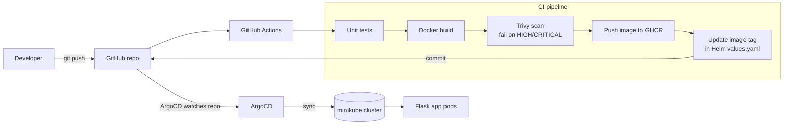
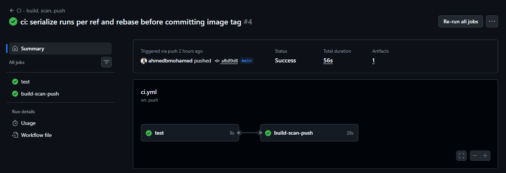
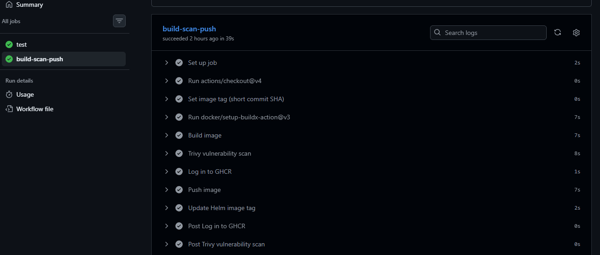
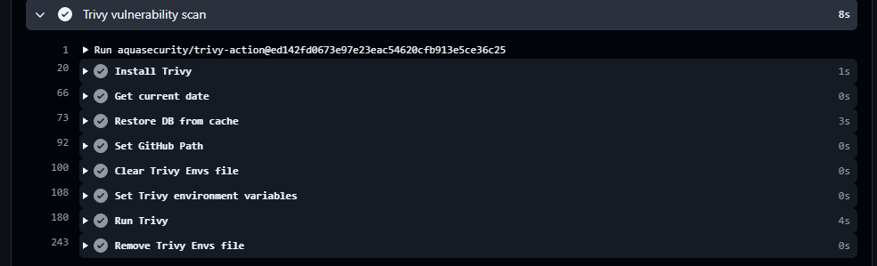
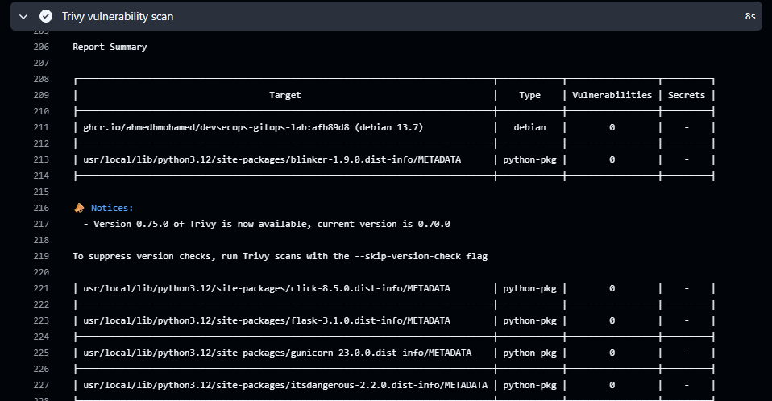
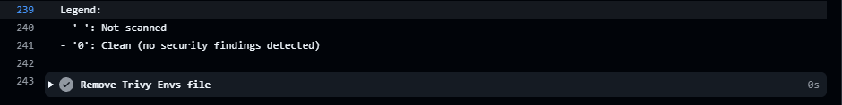
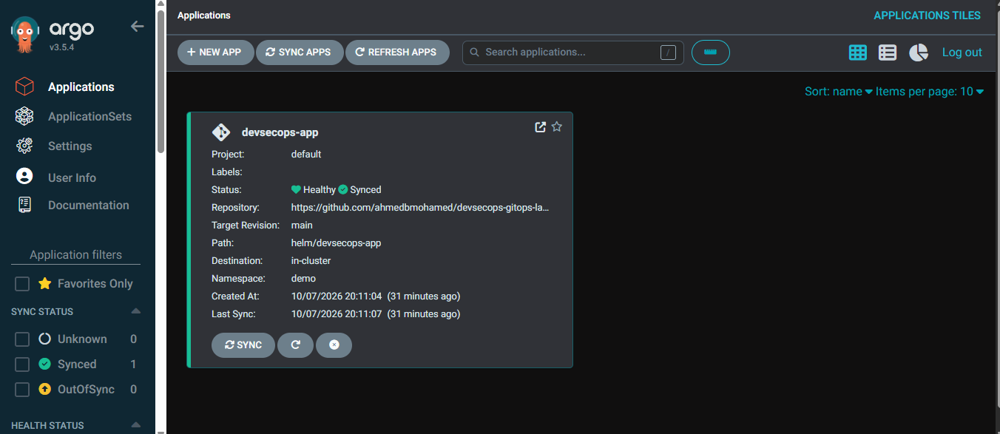
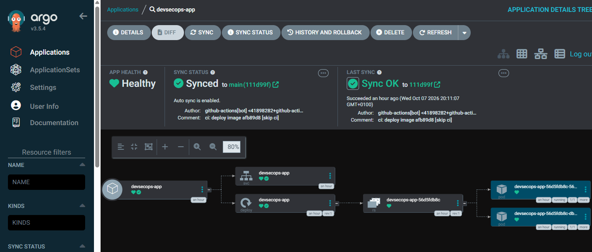
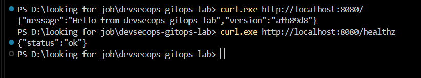

# devsecops-gitops-lab

A hands-on lab showing a complete **DevSecOps + GitOps** flow on a local Kubernetes cluster:
a small Flask app is tested, built, **scanned for vulnerabilities (Trivy)**, pushed to a
container registry, and deployed automatically by **ArgoCD** from a **Helm** chart.

**Stack:** Python (Flask) · Docker · GitHub Actions · Trivy · GHCR · Helm · ArgoCD · minikube

## Architecture



## How it works

1. A push to `main` that changes `app/` triggers the pipeline.
2. **Test** → **Build** → **Trivy scan**. If a fixable HIGH or CRITICAL vulnerability is found, the pipeline fails and nothing is pushed.
3. The image is pushed to GitHub Container Registry (`ghcr.io`) tagged with the short commit SHA.
4. The pipeline commits the new tag into `helm/devsecops-app/values.yaml`.
5. ArgoCD detects the Git change and syncs the cluster automatically (`selfHeal` and `prune` enabled).

Git is the single source of truth: no `kubectl apply` by hand.

## Repository layout

```
app/                    Flask app, Dockerfile, unit tests
helm/devsecops-app/     Helm chart (Deployment, Service, security context, probes)
argocd/application.yaml ArgoCD Application (auto-sync)
.github/workflows/      CI pipeline
docs/SETUP.md           Step-by-step setup guide
```

## Security practices demonstrated

- Image vulnerability scanning with Trivy, enforced as a pipeline gate
- Container runs as non-root, read-only root filesystem, all Linux capabilities dropped
- Resource requests and limits, readiness and liveness probes
- No secrets in the repo; registry login uses the built-in `GITHUB_TOKEN`

## Quick start

See [docs/SETUP.md](docs/SETUP.md) for the full walkthrough (about 45 minutes).

## Screenshots

### CI pipeline


*A push to `main` runs `test`, then `build-scan-push`. The whole run took under a minute.*


*Inside `build-scan-push`: build, Trivy scan, push to GHCR, then commit the new image tag to the Helm values.*

### Security gate (Trivy)


*Trivy scans the freshly built image before anything is pushed.*


*No fixable HIGH or CRITICAL vulnerabilities, so the pipeline is allowed to push.*


*In Trivy's report, `0` means the target was scanned and is clean.*

### GitOps deployment (ArgoCD)


*ArgoCD tracks `helm/devsecops-app` on `main` and reports the app `Healthy` and `Synced`.*


*Synced to the CI bot's tag commit: Service, Deployment, ReplicaSet and two running pods.*

### The running app


*Through a port-forward, `/` returns the deployed version (the commit SHA) and `/healthz` returns `ok`.*

## Problems I hit and fixed

**Wrong action version.** The pipeline failed with `Unable to resolve action aquasecurity/trivy-action@0.28.0`.
After a supply-chain attack, the Trivy maintainers moved every tag to a `v` prefix, so `0.28.0`
no longer existed. I pinned the action to the full commit SHA of `v0.36.0`, checked against the
upstream repo with `git ls-remote`, so a moved or re-pointed tag can't change what runs. I also
pinned the runner to `ubuntu-24.04` instead of `ubuntu-latest`.

**Push race between two runs.** The last pipeline step commits the new image tag and pushes it to
`main`. If two runs overlap, or `main` moves while a run is in progress, that push is rejected as
non-fast-forward. Fix: a `concurrency` group per branch queues runs instead of running them in
parallel, and the step runs `git pull --rebase origin main` before editing `values.yaml`, so the
tag commit always lands on top of the latest `main`.

**Docker Desktop auto-update stopped the cluster.** Docker Desktop updated itself in the
background and restarted its engine. That restarted the minikube container on new ports, and
`kubectl` failed with `connection refused`. `minikube status` showed the kubelet and API server
stopped and the kubeconfig stale. Re-running `minikube start` brought everything back without
data loss and rewrote the kubeconfig. Turning off Docker Desktop's automatic updates prevents it
from happening again.

## What I learned / next steps

- Add a Trivy IaC scan for the Helm chart (`trivy config`)
- Sign images with cosign
- Add an Ingress and TLS
- Add Prometheus metrics
